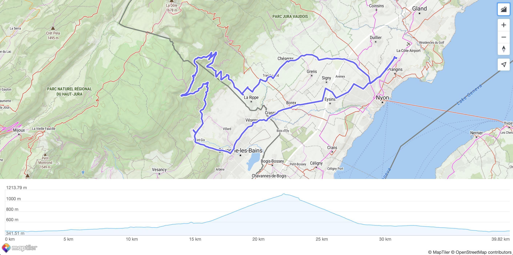
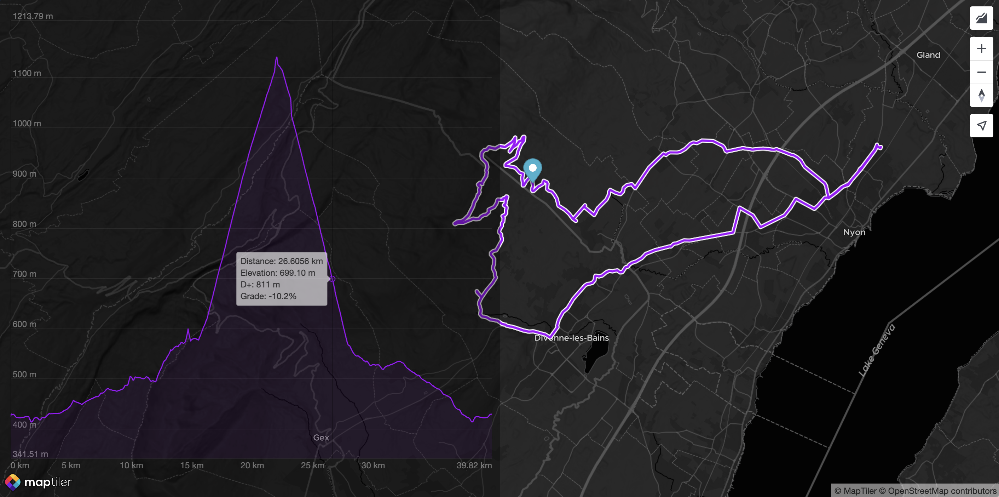
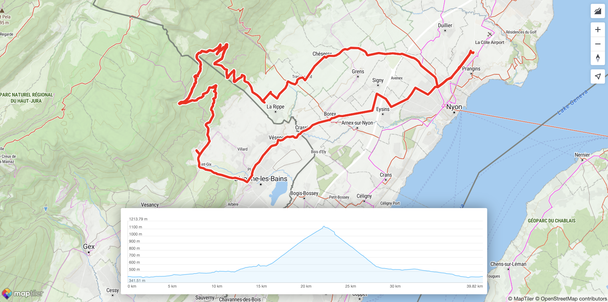
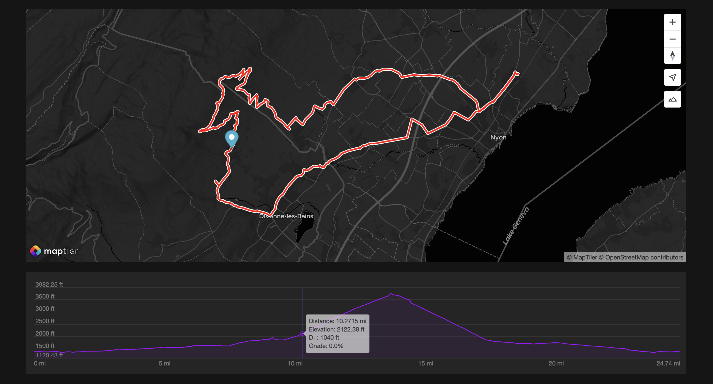
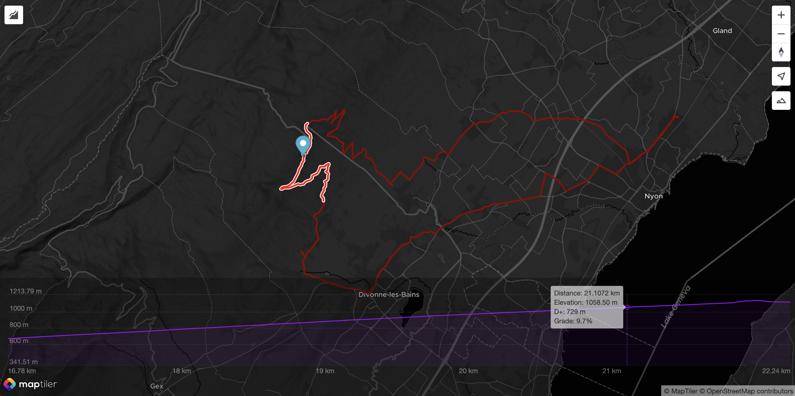

<p align="center">
<a href="https://docs.maptiler.com/sdk-js/">official page →</a><br>
  
</p>

<p align="center" style="color: #AAA">
  Elevation profile control for MapTiler SDK, with elevation data fueled by <a href="https://www.maptiler.com/cloud/">MapTiler Cloud</a>.<br>
</p>

<p align="center">
  
  
  </img>
  </img>
</p>

# Elevation Profile Control
The elevation profile control is a super easy way to show the elevation profile of any GeoJSON trace, whether it's a `LineString`, a `MultiLineString`, whether or not it's encapsulated in a `Feature` or `FeatureCollection`. In case multiple features are eligible in the provided dataset, they will be concatenated and displayed together as a unique route.

It can be customized in many ways and is compatible with both **metric** and **imperial** units. Yet, it comes with many built-in defaults, and does not need a lot to look nice! Here is how the most minimalist setup looks like, featuring **zooming** and **panning** of the profile:



## Usage
Install it:
```bash
npm install @maptiler/elevation-profile-control
```

Import it:
```ts
import { ElevationProfileControl } from "@maptiler/elevation-profile-control";
```

Instanciate it and add it to a `Map` instance, most likely inside a *map* `"load"` event callback:
```ts
// Create an instance (with no options)
const epc = new ElevationProfileControl();

// Add it to your map
map.addControl(epc);

// Add some data (from a URL or a MapTiler Data UUID)
epc.setData("my-route.geojson");
```

## Main Features
### Styling
As many MapTiler SDK (or MapLibre) controls, it is made available with a button on top of the map. By default, the elevation profile chart will also be displayed on top of the map. Yet, you can customize how you want to achieve that.

The following configuration makes the chart sticking to the left, partially transparent to reveal the map underneath:

```ts
const epc = new maptilerelevationprofilecontrol.ElevationProfileControl({
  visible: true, // no need to click, it's there by default
  position: "left",
  backgroundColor: "#0005",
  labelColor: "#FFF6",
  size: "50%", // Take half of the room available (default is 30%)
  elevationGridColor: "#FFF1",
  tooltipTextColor: "#000b",
  tooltipBackgroundColor: "#eeea",
  profileLineColor: "#a103fc",
  profileBackgroundColor: "#a103fc11",
});
```
Here is the result:


A second options to achieve even more custom styling is to use the option `containerClass`. This way, almost all the styling is achieved at application level (rather than internally by the control itself), yet the container is still created by the control. Here is an example:

```ts
const epc = new maptilerelevationprofilecontrol.ElevationProfileControl({
  visible: true,
  // since the text is drawn in the canvas, 
  // it still has to be tuned here:
  fontSize: 9,
  containerClass: "profileContainer",
});
```

Here is the `profileContainer` style definition in CSS:
```css
@keyframes fadeIn {
  from { opacity: 0; }
  to { opacity: 1; }
}

.profileContainer {
  background-color: #fff;
  height: 200px;
  width: 60%;
  position: absolute;
  bottom: 0;
  left: 0;
  right: 0;
  border-radius: 3px;
  margin: 20px auto;
  filter: drop-shadow(0px 0px 15px #00000066);
  animation: fadeIn 0.5s ease forwards;
}
```
Here is the result:


A third way to achieve customization with an even higher level of freedom, is to use the `container` options. Instead of creating the container, the Control will use an existing one, and not alter its styling of the container at all. Here is an example of how to achieve that:
```ts
const epc = new maptilerelevationprofilecontrol.ElevationProfileControl({
  unit: "imperial",
  container: "profileContainer",
  showButton: false,
  labelColor: "#FFF6",
  elevationGridColor: "#FFF1",
  tooltipTextColor: "#000b",
  tooltipBackgroundColor: "#eeea",
  profileLineColor: "#a103fc",
  profileBackgroundColor: "#a103fc11",
  crosshairColor: "#66f5",
  displayTooltip: true,
});
```
For the sake of a better-looking example, the example also comes with some custom colors. Here is how it looks like:


As you can see, the option `showButton` is `false` and as a result, the control button is not showing on top of the map. This can be convenient in such case because we can imagine the container being fully managed at application level.

## Computing Elevation
In some cases, the route data passed to the method `.setData()` will contain only *longitude* and *latitude* information, but no elevation. In that case, the control will automatically fetch and compute the elevation data prior to display the profile. Under the hood, this operation is performed by the [MapTiler Client library](https://docs.maptiler.com/client-js/).

## Events
There are three events available that can be defined in the constructor options:
- `onMove` when moving the pointer on top of the profile
- `onClick` when clicking on the profile
- `onChangeView` when zooming or panning the profile

With the event `onMove` we can easily display a marker moving on top of the map. With the event `onChangeView`, we have access to a GeoJSON *LineString* corresponding to the zoomed section, that we can then display on top of the full-length route:


(Note: this can easily be achieved with the *Polyline Helper* available in the MapTiler SDK)

## All the options
<details>
  <summary>Know more about ElevationProfileControl constructor options</summary>

The constructor `ElevationProfileControl` can have many options, for instance, displaying the elevation line in red:

```ts
const epc = new ElevationProfileControl({ profileLineColor: "red" });
```

Below is the complete list of options:
```ts
{
  /**
   * If `true`, the elevation profile control will be visible as soon as it's ready.
   * If `false`, a click on the control button (or a programmatic call to `.showProfile()`)
   * will be neccesary to show the profile.
   *
   * Default: `false`
   */
  visible?: boolean;
  /**
   * Size of the profile as a CSS rule.
   * This `size` will be the `width` if the `.position` is "left" or "right",
   * and will be the `height` if the `.position` is "top" or "bottom".
   *
   * Default: `"30%"`
   */
  size?: string;
  /**
   * Position of the elevation profile chart when shown.
   *
   * Default: `"botton"`
   */
  position?: "top" | "left" | "right" | "bottom";
  /**
   * Show the control button. If can be handy to hide it, especially if the profile is displayed
   * in a custom container and that its visiblity is managed by logic external to this control.
   *
   * Default: `true`
   */
  showButton?: boolean;
  /**
   * A CSS class to add to the container. This is especially relevant when the options `.container` is not provided.
   * Important: if provided, no styling is added by this control and even placement will have to be managed by external CSS.
   *
   * Default: `""`
   */
  containerClass?: string;
  /**
   * DIV element to contain the control.
   * Important: if provided, no styling is added by this control.
   * Default: automatically created inside the map container
   */
  container?: string | HTMLDivElement;
  /**
   * Color of the background of the chart
   */
  backgroundColor?: string | null;
  /**
   * Unit system to use.
   * If "metric", elevation and D+ will be in meters, distances will be in km.
   * If "imperial", elevation and D+ will be in feet, distances will be in miles.
   *
   * Default: "metric"
   */
  unit?: "metric" | "imperial";
  /**
   * Font size applied to axes labels and tooltip.
   *
   * Default: `12`
   */
  fontSize?: number;
  /**
   * If `true`, will force the computation of the elevation of the GeoJSON data provided to the `.setData()` method,
   * even if they already contain elevation (possibly from GPS while recording). If `false`, the elevation will only
   * be computed if missing from the positions.
   *
   * Default: `false`
   */
  forceComputeElevation?: boolean;
  /**
   * Display the elevation label along the vertical axis.
   *
   * Default: `true`
   */
  displayElevationLabels?: boolean;
  /**
   * Display the distance labels alon the horizontal axis.
   *
   * Default: `true`
   */
  displayDistanceLabels?: boolean;
  /**
   * Display the distance and elevation units alongside the labels.
   *
   * Default: `true`
   */
  displayUnits?: boolean;
  /**
   * Color of the elevation and distance labels.
   *
   * Default: `"#0009"` (partially transparent black)
   */
  labelColor?: string;
  /**
   * Color of the elevation profile line.
   * Can be `null` to not display the line and rely on the background color only.
   *
   * Default: `"#66ccff"`
   */
  profileLineColor?: string | null;
  /**
   * Width of the elevation profile line.
   *
   * Default: `1.5`
   */
  profileLineWidth?: number;
  /**
   * Color of the elevation profile background (below the profile line)
   * Can be `null` to not display any backgound color.
   *
   * Default: `"#66ccff22"`
   */
  profileBackgroundColor?: string | null;
  /**
   * Display the tooltip folowing the pointer.
   *
   * Default: `true`
   */
  displayTooltip?: boolean;
  /**
   * Color of the text inside the tooltip.
   *
   * Default: `"#fff"`
   */
  tooltipTextColor?: string;
  /**
   * Color of the tooltip background.
   *
   * Default: `"#000A"` (partially transparent black)
   */
  tooltipBackgroundColor?: string;
  /**
   * Display the distance information inside the tooltip if `true`.
   *
   * Default: `true`
   */
  tooltipDisplayDistance?: boolean;
  /**
   * Display the elevation information inside the tooltip if `true`.
   *
   * Default: `true`
   */
  tooltipDisplayElevation?: boolean;
  /**
   * Display the D+ (cumulated positive ascent) inside the tooltip if `true`.
   *
   * Default: `true`
   */
  tooltipDisplayDPlus?: boolean;
  /**
   * Display the slope grade in percentage inside the tooltip if `true`.
   *
   * Default: `true`
   */
  tooltipDisplayGrade?: boolean;
  /**
   * Display the distance grid lines (vertical lines matching the distance labels) if `true`.
   *
   * Default: `false`
   */
  displayDistanceGrid?: boolean;
  /**
   * Display the elevation grid lines (horizontal lines matching the elevation labels) if `true`.
   *
   * Default: `true`
   */
  displayElevationGrid?: boolean;
  /**
   * Color of the distance grid lines.
   *
   * Default: `"#0001"` (partially transparent black)
   */
  distanceGridColor?: string;
  /**
   * Color of the elevation drig lines.
   *
   * Default: `"#0001"` (partially transparent black)
   */
  elevationGridColor?: string;
  /**
   * Padding at the top of the chart, in number of pixels.
   *
   * Default: `30`
   */
  paddingTop?: number;
  /**
   * Padding at the bottom of the chart, in number of pixels.
   *
   * Default: `10`
   */
  paddingBottom?: number;
  /**
   * Padding at the left of the chart, in number of pixels.
   *
   * Default: `10`
   */
  paddingLeft?: number;
  /**
   * Padding at the right of the chart, in number of pixels.
   *
   * Default: `10`
   */
  paddingRight?: number;
  /**
   * Display the crosshair, a vertical line that follows the pointer, if `true`.
   *
   * Default: `true`
   */
  displayCrosshair?: boolean;
  /**
   * Color of the crosshair.
   *
   * Default: `"#0005"` (partially transparent black)
   */
  crosshairColor?: string;
  /**
   * Callback function to call when the chart is zoomed or panned.
   * The argument `windowedLineString` is the GeoJSON LineString corresponding
   * to the portion of the route visible in the elevation chart.
   *
   * Default: `null`
   */
  onChangeView?: ((windowedLineString: LineString) => void) | null;
  /**
   * Callback function to call when the the elevation chart is clicked.
   *
   * Default: `null`
   */
  onClick?: ((data: CallbackData) => void) | null;
  /**
   * Callback function to call when the pointer is moving on the elevation chart.
   *
   * Default: `null`
   */
  onMove?: ((data: CallbackData) => void) | null;
}
```

With `CallbackData` being:
```ts
{
  /**
   * The position as `[lon, lat, elevation]`.
   * Elevation will be in meters if the component has been set with the unit "metric" (default)
   * of in feet if the unit is "imperial".
   */
  position: Position;
  /**
   * The distance from the start of the route. In km if the component has been set with the unit "metric" (default)
   * of in miles if the unit is "imperial".
   */
  distance: number;
  /**
   * Cumulated positive elevation from the begining of the route up to this location.
   * In meters if the component has been set with the unit "metric" (default)
   * of in feet if the unit is "imperial".
   */
  dPlus: number;
  /**
   * Slope grade in percentage (1% being a increase of 1m on a 100m distance)
   */
  gradePercent: number;
};
```
</details>

Find more usage examples in [the documentation](https://docs.maptiler.com/sdk-js/examples/).


